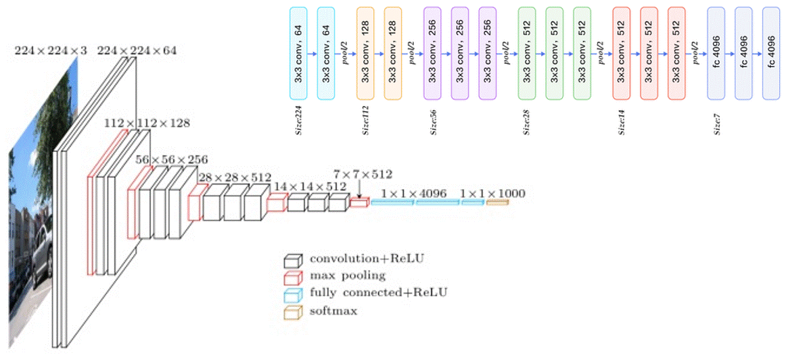
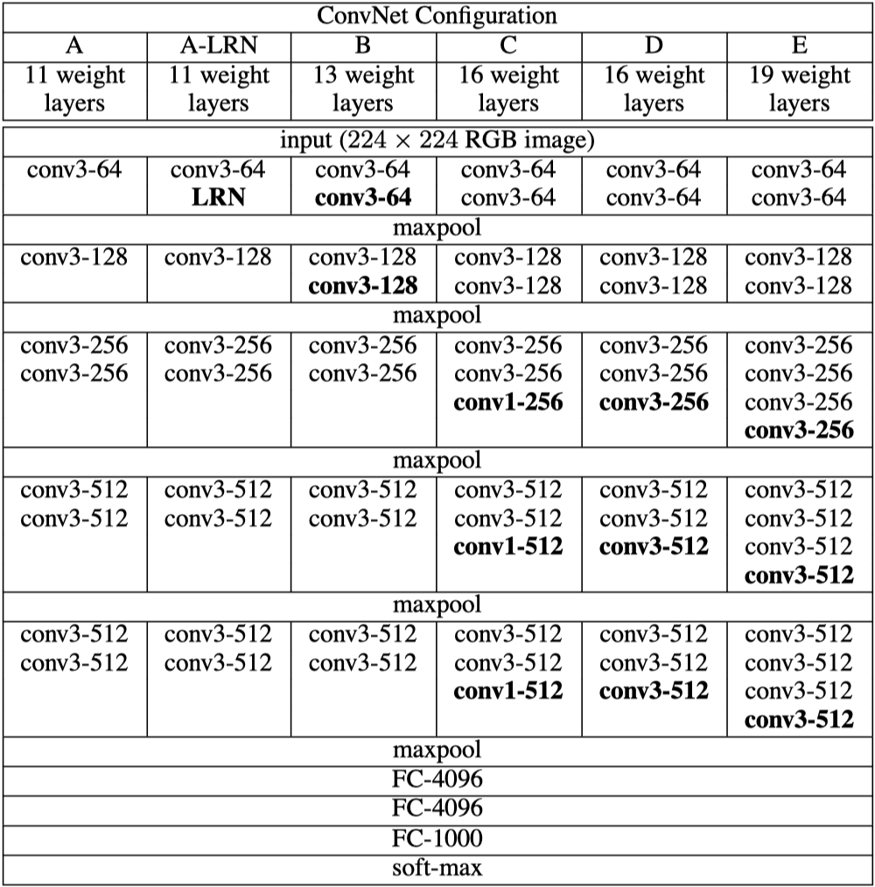
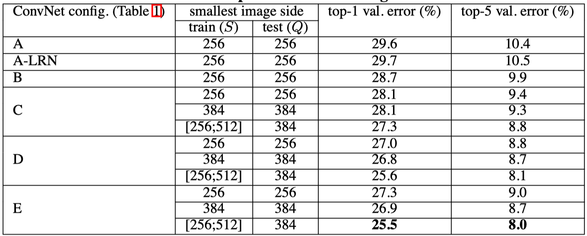
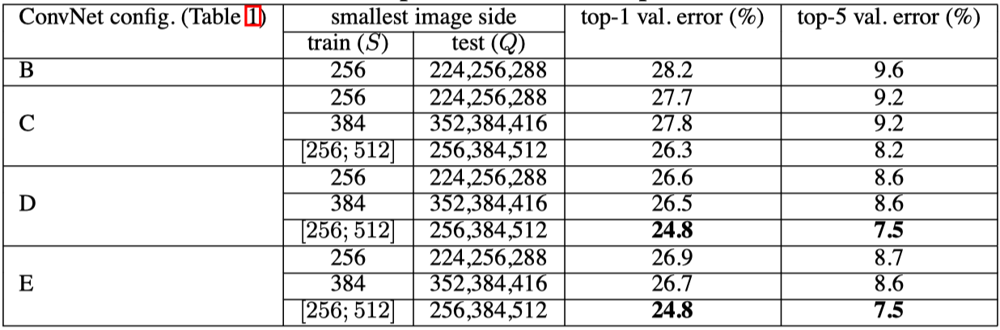

# PaperReadingNote

## Very Deep Convolutional Networks For Large-scale Image Recognition

### 解决的问题

提高了神经网络在ImageNet上的分类精度；解决了卷积神经网络架构设计中的深度问题。

### 主要贡献

通过采用较小的卷积滤波器（3x3）来增加更多的卷积层，从而使得构建更深的网络（11-19层）成为可能。

### 网络结构

VGGNet有六种不同的配置，从11层到19层。其具有一系列的卷积层，随着深度的增加，卷积层宽度（滤波器的数量）会加倍（x2，直到宽度达到512），如下图所示，在第一个block，卷积层宽度为64，第二个block中为128，第三个block中为256，在第四、五个block中为512。在每一个卷积计算block之后，会加入一个最大池化层（降低计算代价等）。在逐层卷积层之后，会采用全连接层和softmax层来输出分类的结果。

### 使用3x3卷积滤波器的原因

1. 相较于7x7的卷积核，3x3卷积核具有更少的参数，假设卷积层有C个通道，则单个7x7卷积层的参数为7x7xCxC=49C^2，而三个3x3卷积层的参数为3x(3x3xCxC)=27C^2；
2. 3x3卷积核类似于对7x7卷积核的正则化。

### 关于1x1卷积滤波器的问题

1x1卷积滤波器是一种增加非线性的方法，而不会影响卷积层的感受野。

### 训练图像尺寸的问题

在这篇论文中提出了两种设置训练尺度的方法。

- 第一种方法固定了训练图像尺寸（单尺度训练），这篇文章中选择了256和384两种尺寸。
- 第二种方法是多尺度训练，其中每一个训练图像将会被随机的尺度S（Smin <= S <= Smax）重缩放。

从结果来看，多尺度训练模式最终验证误差要低于单尺度训练模式。

 

